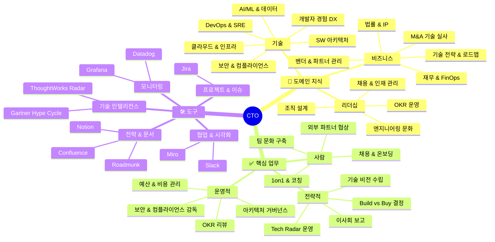
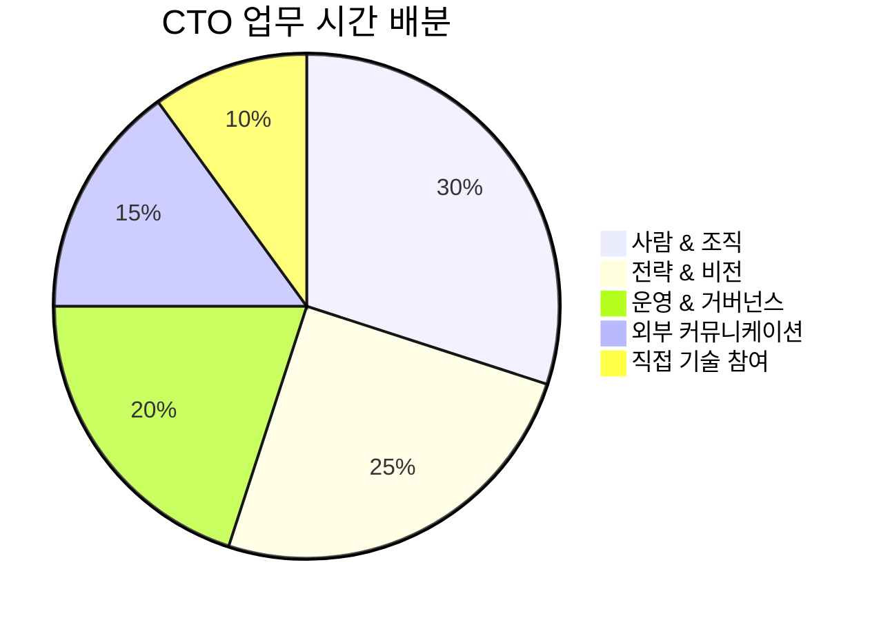
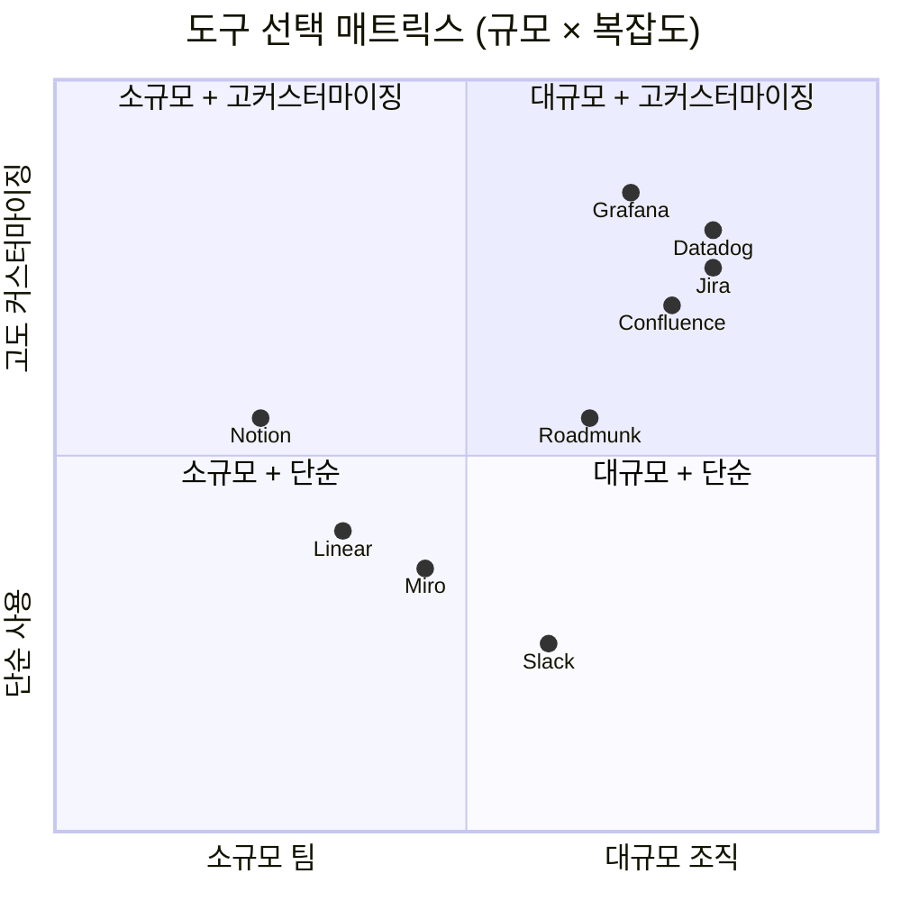

# CTO — 종합 가이드

> 도메인 지식 · 핵심 업무 · 도구를 한 파일로 정리한 CTO 레퍼런스

---

## 전체 지식 맵

---

## 🧠 도메인 지식

### 기술 영역

| 분야 | 핵심 개념 & 키워드 | CTO가 알아야 하는 이유 |
|---|---|---|
| **소프트웨어 아키텍처** | 마이크로서비스, 이벤트 드리븐, CQRS, 모놀리스 vs 분산 | 기술 방향 결정, 아키텍처 리뷰 주재 |
| **클라우드 & 인프라** | AWS/GCP/Azure, IaaS/PaaS/SaaS, FinOps, 멀티클라우드 | 비용 최적화 · 스케일링 전략 수립 |
| **보안 & 컴플라이언스** | GDPR, SOC 2, ISO 27001, Zero Trust, OWASP | 규제 대응 · 법적 리스크 최소화 |
| **AI/ML & 데이터** | LLM, MLOps, Data Governance, RAG, 데이터 레이크 | 제품 혁신 전략 · AI 투자 우선순위 결정 |
| **DevOps & SRE** | CI/CD, SLO/SLA, 블루-그린 배포, 카오스 엔지니어링 | 배포 속도 · 시스템 안정성 확보 |
| **개발자 경험 (DX)** | Platform Engineering, IDP, 개발자 생산성 지표 | 엔지니어 생산성 복리 효과 창출 |

### 비즈니스 / 경영 영역

| 분야 | 핵심 개념 & 키워드 | CTO가 알아야 하는 이유 |
|---|---|---|
| **기술 전략** | [[Technology-Strategy-Planning\|기술 로드맵]], [[Tech-Radar]], Gartner Hype Cycle | 조직의 3~5년 기술 방향 리드 |
| **재무 & FinOps** | CapEx vs OpEx, TCO, ROI, 클라우드 비용 최적화 | 기술 투자 정당화 · 예산 요청 근거 마련 |
| **M&A 기술 실사** | Tech Due Diligence, 기술 부채 평가, 코드 품질 감사 | 인수 시 숨겨진 기술 리스크 파악 |
| **벤더 & 파트너 관리** | SLA 협상, 계약 조건, [[Build-vs-Buy]] 프레임워크 | 외부 의존성 관리 · 계약 리스크 통제 |
| **법률 & IP** | 오픈소스 라이선스(MIT/GPL), 특허, 개인정보보호법 | 법적 분쟁 방지 · 지식재산 보호 |

### 리더십 / 조직 영역

| 분야 | 핵심 개념 & 키워드 | CTO가 알아야 하는 이유 |
|---|---|---|
| **조직 설계** | [[Engineering-Organization-Models\|Team Topologies]], Spotify 모델, Conway's Law | 빠르고 자율적인 팀 구조 설계 |
| **목표 관리** | [[OKR]], KPI, 성과 리뷰, 계단식 목표 정렬 | 엔지니어링 목표와 비즈니스 정렬 |
| **채용 & 인재** | 기술 면접 설계, 커리어 레더, eNPS, 이탈률 관리 | 조직 역량 유지 · 인재 파이프라인 확보 |
| **엔지니어링 문화** | [[Engineering-Culture]], 심리적 안전감, Blameless Postmortem | 고성과 팀의 기반 — 혁신의 필수 조건 |

---

## ✅ 핵심 업무

### 업무 시간 배분 (참고용)

### 전략적 업무

- **기술 비전 수립** — "3년 후 시스템은 어떤 모습이어야 하는가?"를 정의하고 문서화 → [[Technology-Strategy-Planning]]
- **Tech Radar 운영** — 반기마다 기술 후보를 Adopt · Trial · Assess · Hold로 분류 → [[Tech-Radar-Review-Process]]
- **[[Build-vs-Buy]] 결정** — 자체 개발 vs 외부 솔루션 구매 기준 수립 및 의사결정
- **이사회 & 경영진 보고** — 기술 성과를 비즈니스 임팩트 언어로 번역해 보고 → [[Quarterly-Review-Checklist]]

### 운영적 업무

- **분기별 OKR 리뷰** — 목표 달성률 점검, 지연 원인 분석, 다음 분기 재정렬 → [[Quarterly-Review-Checklist]]
- **아키텍처 거버넌스** — 주요 기술 결정 승인, ADR 검토, 팀 자율성과 일관성 균형 유지
- **보안 & 컴플라이언스 감독** — 취약점 패치 현황 확인, 감사 대응, 보안 정책 방향 결정
- **예산 & 비용 관리** — 클라우드 비용 트렌드 모니터링, 인프라 투자 요청 준비

### 사람 관련 업무

- **채용 주도** — 포지션 우선순위 결정, 최종 면접 참여, 오퍼 결정 → [[Engineering-Hiring-Process]]
- **1:1 & 코칭** — 엔지니어링 리더(EM, 시니어)와 정기 1:1. 성장 방향 제시
- **팀 문화 구축** — 심리적 안전감 조성, Blameless Postmortem 실행, 기술 학습 환경 지원 → [[Engineering-Culture]]
- **외부 대표 역할** — 컨퍼런스 발표, 외부 파트너 협상, 개발자 브랜딩

### 연간 업무 리듬

| 시점 | 주요 활동 |
|:---:|---|
| **Q1 초** | 연간 기술 전략 수립, Tech Radar 발행, OKR 확정 |
| **Q1 말** | 1분기 OKR 리뷰, 채용 파이프라인 점검 |
| **Q2** | 기술 로드맵 중간 점검, 상반기 예산 검토, 보안 감사 |
| **Q2 말** | 반기 Tech Radar 갱신 검토 개시 |
| **Q3** | 하반기 전략 조정, 컨퍼런스 시즌, 내년 예산 준비 시작 |
| **Q3 말** | Tech Radar 업데이트 발행 |
| **Q4** | 내년 기술 전략 기획, 성과 리뷰, 내년 OKR 초안 작성 |
| **Q4 말** | 연간 엔지니어링 회고, 이사회 연간 보고 |

---

## 🛠️ 도구

### 도구 전체 목록

| 도구 | 카테고리 | 주요 용도 | 대안 |
|---|---|---|---|
| **[[Notion]]** | 문서 & 위키 | 기술 전략 문서, OKR 트래킹, 채용 파이프라인 | Confluence |
| **[[Confluence]]** | 문서 & 위키 | 팀 위키, 기술 결정 기록, Jira 연동 | Notion |
| **[[Roadmunk]]** | 로드맵 시각화 | 경영진용 기술 로드맵 · 타임라인 | ProductPlan, Aha! |
| **[[Miro]]** | 시각화 & 협업 | 전략 워크숍, 아키텍처 다이어그램, 브레인스토밍 | Mural, FigJam |
| **[[Slack]]** | 커뮤니케이션 | 팀 채널, 이슈 알림, 비동기 의사결정 | Teams, Discord |
| **[[Jira]]** | 프로젝트 관리 | 이슈 트래킹, 스프린트 진행 현황 파악 | Linear, Asana |
| **Datadog / Grafana** | 모니터링 | SLO/SLA 대시보드, 장애 파악 | New Relic, Dynatrace |
| **GitHub / GitLab** | 코드 & 협업 | PR 트렌드 파악, 코드 현황 조감, 개발 속도 지표 | Bitbucket |
| **Gartner Hype Cycle** | 기술 인텔리전스 | 기술 성숙도 평가, 투자 타이밍 판단 | ThoughtWorks Radar |
| **ThoughtWorks Radar** | Tech Radar | 기술 포트폴리오 시각화 도구 | 자체 제작 |
| **Lattice / 15Five** | 성과 관리 | eNPS 측정, 1:1 기록, 성과 리뷰 | Culture Amp |

### 도구 선택 가이드

> 스타트업(~50명): Notion + Linear + Slack 조합이 낮은 운영 비용으로 충분  
> 스케일업(50~200명): Confluence + Jira + Roadmunk로 전환 검토  
> 대규모(200명+): Jira + Confluence + Datadog + 전용 HR 도구 풀스택 구성

---

## 관련 노트

### 도메인 지식
- [[Engineering-Organization-Models]] — 팀 구조 모델 비교
- [[Cloud-Native]] — 클라우드 네이티브 아키텍처 개념
- [[Technology-Lifecycle]] — 기술 성숙도 & 도입 시점 판단
- [[CTO-Leadership-Principles]] — CTO의 7가지 의사결정 원칙
- [[Technology-Decision-Making]] — 기술 의사결정 프레임워크

### 용어
- [[OKR]] — 목표 및 핵심 결과 지표
- [[Technical-Debt]] — 기술 부채 정의 & 관리 전략
- [[Tech-Radar]] — 기술 포트폴리오 관리 도구
- [[Build-vs-Buy]] — 자체 개발 vs 구매 판단 기준
- [[Engineering-Culture]] — 고성과 개발 문화 구축
- [[Platform-Strategy]] — 플랫폼 전략 수립 방법
- [[DORA-Metrics]] — 엔지니어링 성과 4가지 핵심 지표
- [[Conway-Law]] — 조직 구조가 아키텍처를 결정하는 법칙
- [[FinOps]] — 클라우드 비용 관리 원칙과 실천

### 워크플로우
- [[Technology-Strategy-Planning]] — 연간 기술 전략 기획 절차
- [[Tech-Radar-Review-Process]] — Tech Radar 갱신 프로세스
- [[Engineering-Hiring-Process]] — 엔지니어링 채용 흐름
- [[Board-Reporting-Process]] — 이사회·경영진 보고 절차
- [[Budget-Planning-Process]] — 연간 기술 예산 기획 절차
- [[Incident-Response-Process]] — 장애 대응 및 커뮤니케이션 흐름

### 체크리스트
- [[Quarterly-Review-Checklist]] — 분기별 리뷰 항목
- [[Tech-Evaluation-Checklist]] — 기술 도입 평가 항목
- [[CTO-Onboarding-Checklist]] — 신임 CTO 첫 30·60·90일

### 템플릿
- [[Tech-Vision-Template]] — 기술 비전 문서 작성 양식
- [[Engineering-OKR-Template]] — 엔지니어링 OKR 초안 양식
- [[Post-Mortem-Template]] — 장애 회고 문서 작성 양식
