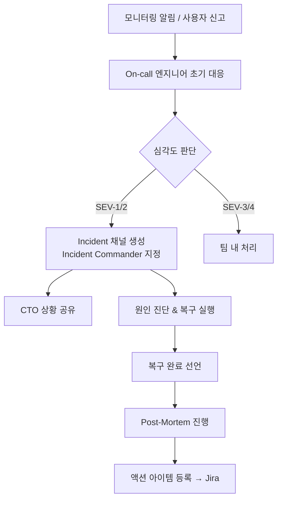

# Incident Response Process

> 장애 발생 시 CTO 관점의 대응 절차 및 커뮤니케이션 흐름

## Overview

프로덕션 장애(Incident) 발생 시 기술팀이 체계적으로 대응하고, CTO가 적절한 시점에 개입해 의사결정과 이해관계자 커뮤니케이션을 주도하는 프로세스. 장애 대응 속도만큼 중요한 것은 **커뮤니케이션**과 **재발 방지**다.

## 심각도 기준 (Severity Level)

| 등급 | 기준 | CTO 개입 시점 |
|:---:|---|:---:|
| **SEV-1** | 전체 서비스 중단 또는 데이터 손실 위험 | 즉시 |
| **SEV-2** | 핵심 기능 장애, 다수 사용자 영향 | 30분 내 |
| **SEV-3** | 부분 기능 저하, 소수 사용자 영향 | 상황 파악 후 |
| **SEV-4** | 경미한 오류, 회피 방법 존재 | 불필요 |

## 대응 흐름

## Phase별 상세 절차

### Phase 1: 감지 & 초기 대응 (0~15분)
- [[Datadog]] / [[Grafana]] 알림 또는 사용자 신고로 장애 감지
- On-call 엔지니어 즉시 대응 시작
- [[Slack]] 인시던트 채널 생성: `#incident-YYYYMMDD-{description}`
- Incident Commander 지정 (엔지니어링 리드 또는 SRE)
- 초기 영향 범위 파악 및 심각도 등급 결정

### Phase 2: 진단 & 복구 (15분~복구)
- Root Cause 추적 (로그·트레이스·메트릭 분석)
- **복구 우선**: 원인 분석보다 빠른 서비스 복구 (롤백·우회)
- 5분마다 인시던트 채널에 상황 업데이트 포스팅

### Phase 3: CTO 커뮤니케이션

| 시점 | CTO 액션 |
|---|---|
| SEV-1 발생 즉시 | CEO·CPO에게 초기 상황 1문장 요약 공유 |
| 30분 경과 | 예상 복구 시간 업데이트. 고객 공지 여부 결정 |
| 복구 완료 | 경영진에 복구 완료 + 임시 원인 공유 |
| 24시간 내 | Post-Mortem 일정 공지 |

### Phase 4: 복구 확인 (복구 직후)
- 모니터링 지표 정상화 확인
- 인시던트 채널에 복구 선언 및 요약 포스팅
- 관련 [[Jira]] 이슈 생성 (Post-Mortem 액션 아이템 추적용)
- On-call 엔지니어 수고 인정 (심리적 안전감 → [[Engineering-Culture]])

### Phase 5: Post-Mortem (24~72시간 내)
- 관련자 전체 참여. 비난 없는 분위기 필수 (Blameless)
- 타임라인·근본 원인·개선 액션 아이템 작성 → [[Post-Mortem-Template]] 활용
- [[Confluence]] 게시, 전팀 공유

## CTO 커뮤니케이션 원칙

1. **투명하게** — 문제를 숨기면 신뢰를 잃는다. 빠른 공유가 낫다
2. **해결책과 함께** — 문제만 전달하지 말고 "현재 하고 있는 것"을 함께 공유
3. **과도한 약속 금지** — 확실하지 않은 복구 시간을 약속하지 않는다
4. **Blameless** — 개인이 아닌 시스템과 프로세스에 집중 → [[Engineering-Culture]]

## Inputs

- 모니터링 알림 ([[Datadog]], [[Grafana]])
- On-call 로테이션 스케줄
- 서비스별 런북(Runbook) 문서

## Outputs

- 인시던트 타임라인 기록 ([[Slack]] 채널 아카이브)
- Post-Mortem 문서 ([[Confluence]])
- 재발 방지 액션 아이템 ([[Jira]])

## Notes

- SLO 에러 버짓 소진 현황은 [[Quarterly-Review-Checklist]]에 반영
- 반복되는 인시던트 패턴은 [[Technical-Debt]]의 신호
- On-call 부담이 과도하면 [[Engineering-Culture]]와 채용([[Engineering-Hiring-Process]])을 점검할 것
