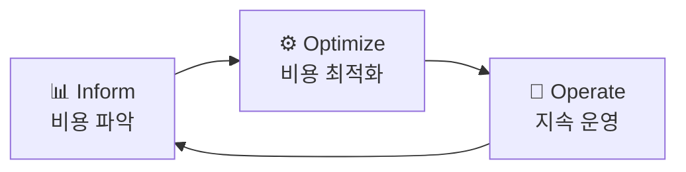

# FinOps

## Definition

**Cloud Financial Operations**의 줄임말. 클라우드 비용을 재무팀·엔지니어링팀·비즈니스팀이 **공동으로 책임지고 최적화**하는 원칙과 실천 방식. "엔지니어링이 비용 의사결정에 참여하고, 재무팀이 기술 맥락을 이해"하는 협업 문화다.

## FinOps 사이클

| 단계 | 활동 |
|---|---|
| **Inform (파악)** | 팀·서비스별 비용 태깅, 대시보드 구축, 예산 대비 실적 파악 |
| **Optimize (최적화)** | Reserved Instance, Rightsizing, 미사용 리소스 삭제 |
| **Operate (운영)** | 비용 이상 알림, 분기별 비용 리뷰, 팀별 비용 목표 설정 |

## 핵심 원칙 (FinOps Foundation)

1. **팀 간 협업** — 재무·엔지니어링·제품팀이 함께 클라우드 비용 관리
2. **비즈니스 가치 중심** — 비용 절감보다 비용 대비 가치(Unit Economics) 최적화
3. **데이터 기반 결정** — 실시간 비용 데이터로 의사결정
4. **엔지니어의 비용 책임** — 팀이 자신의 리소스 비용을 인식하고 최적화

## 주요 최적화 기법

| 기법 | 절감 효과 | 설명 |
|---|:---:|---|
| **Reserved Instances** | 20~40% | 1~3년 약정으로 온디맨드 대비 할인 |
| **Savings Plans** | 최대 66% | 사용량 약정 기반 유연한 할인 |
| **Rightsizing** | 10~30% | 실제 사용률 기반 인스턴스 크기 조정 |
| **Spot Instances** | 60~90% | 중단 가능한 워크로드에 적용 (배치, CI 등) |
| **Auto Scaling** | 가변 | 트래픽 기반 자동 스케일 인/아웃 |
| **태그 정책 (Tagging)** | 가시성 확보 | 팀·서비스·환경별 비용 추적 기반 |

## CTO 관점

- 클라우드 비용은 **매출 대비 비율**로 추적 (예: 매출의 X%)
- [[OKR]] Key Result로 "인프라 비용 Y% 절감" 설정 가능
- 비용 급증은 아키텍처 문제 신호일 수 있음 → [[Technical-Debt]]
- [[Budget-Planning-Process]]에서 FinOps 데이터가 예산 산정의 핵심 인풋
- [[Datadog]] / [[Grafana]]로 실시간 비용 트렌드 모니터링

## Related Terms

- [[Technical-Debt]] — 비효율적 아키텍처가 비용 낭비로 이어짐
- [[Platform-Strategy]] — Internal Platform이 비용 최적화를 중앙화
- [[OKR]] — 비용 절감 목표를 KR로 정량화
- [[Cloud-Native]] — Cloud Native 아키텍처가 FinOps 최적화의 기반

## References

- [FinOps Foundation](https://www.finops.org/)
- [AWS 비용 최적화](https://aws.amazon.com/aws-cost-management/)
- [Google Cloud FinOps](https://cloud.google.com/blog/topics/cost-management)
