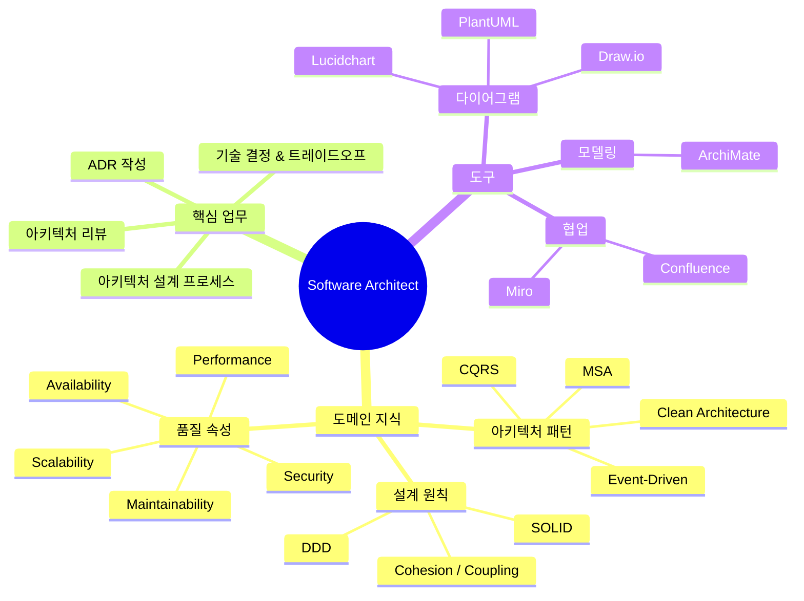

# Software Architect Guide

> 소프트웨어 아키텍트의 역할·지식·실천을 한 파일로 정리한 종합 가이드

---

## 전체 지식 맵



---

## 소프트웨어 아키텍트란?

소프트웨어 아키텍트는 **시스템의 전체 구조를 설계하고, 기술 결정의 품질과 일관성을 책임지는 역할**이다.

| 구분 | 소프트웨어 아키텍트 | CTO |
|---|---|---|
| **초점** | 단일 시스템 / 서비스 군의 설계 | 조직 전체 기술 방향 |
| **결정 단위** | 컴포넌트·패턴·기술 스택 | 기술 전략·조직·예산 |
| **산출물** | 아키텍처 문서, ADR, C4 다이어그램 | Tech Roadmap, OKR |
| **대화 상대** | 개발팀, 시니어 개발자 | C-Level, 투자자, 이사회 |

---

## 핵심 도메인 지식

### 아키텍처 패턴 (무엇을 선택하는가)

| 패턴 | 적합한 상황 | 주의점 |
|---|---|---|
| **Monolith** | 초기, 작은 팀 | 규모 커지면 의존성 관리 어려움 |
| **MSA** | 독립 배포·확장 필요, 팀 규모 큼 | 분산 시스템 복잡도 |
| **Event-Driven** | 낮은 결합도, 비동기 처리 | 최종 일관성, 디버깅 어려움 |
| **CQRS** | 읽기/쓰기 부하 차이 큼 | 복잡도 증가 |
| **Clean Architecture** | 복잡한 도메인, 장기 유지보수 | 과도한 레이어링 위험 |

### 설계 원칙 (어떻게 설계하는가)

- **[[SOLID]]**: 클래스·컴포넌트 설계의 기본 원칙
- **[[Cohesion|높은 응집도]]**: 모듈은 하나의 책임만
- **[[Coupling|낮은 결합도]]**: 모듈 간 의존 최소화
- **[[Domain-Driven-Design|DDD]]**: 복잡한 도메인을 소프트웨어에 반영

### 품질 속성 트레이드오프

```mermaid
quadrantChart
    title 아키텍처 선택의 트레이드오프
    x-axis 단순성 낮음 --> 단순성 높음
    y-axis 성능 낮음 --> 성능 높음
    quadrant-1 유연하지만 복잡
    quadrant-2 이상적 (어렵지만 목표)
    quadrant-3 단순하지만 한계
    quadrant-4 단순하고 빠름
    Monolith: [0.8, 0.4]
    MSA: [0.2, 0.8]
    CQRS: [0.3, 0.85]
    Event-Driven: [0.25, 0.75]
    Clean Architecture: [0.35, 0.6]
```

---

## 핵심 업무 흐름

### 1. 아키텍처 설계 프로세스

```
요구사항 수집 (기능 + NFR)
→ 현황 분석 (As-Is)
→ 아키텍처 드라이버 식별
→ 도메인 모델 설계 (Event Storming)
→ 패턴 탐색 & 트레이드오프 분석
→ 아키텍처 스케치 (Miro)
→ 주요 시나리오 워크스루
→ ADR 작성
→ 다이어그램 작성 (C4 모델)
→ 문서화 (Confluence)
→ 아키텍처 리뷰
```

→ 상세: [[Architecture-Design-Process]]

### 2. ADR 작성 프로세스

```
결정 필요 인식 → 컨텍스트 작성 → 대안 탐색
→ 의사결정 → 근거 작성 → 결과 작성
→ 팀 리뷰 → 문서 저장
```

→ 상세: [[ADR-Writing-Process]] | 템플릿: [[ADR-Template]]

### 3. 아키텍처 리뷰 프로세스

```
리뷰 준비 (2~3일 전) → 컨텍스트 공유
→ 아키텍처 워크스루 → 질문 & 피드백
→ 체크리스트 검토 → 액션 아이템 도출
→ 결과 문서화 → 피드백 반영
```

→ 상세: [[Architecture-Review-Process]] | 체크리스트: [[Architecture-Review-Checklist]]

---

## 주요 산출물

| 산출물 | 목적 | 도구 |
|---|---|---|
| **C4 다이어그램** (Context/Container/Component) | 시스템 구조 시각화 | [[Draw-io]], [[Lucidchart]] |
| **ADR** (Architecture Decision Record) | 기술 결정 기록 | [[Confluence]], Git |
| **Architecture Design Document** | 전체 설계 문서화 | [[Confluence]] |
| **Event Storming 보드** | 도메인 탐색 | [[Miro]] |
| **시퀀스 다이어그램** | API/통신 흐름 문서화 | [[PlantUML]] |

---

## 도구 선택 가이드

| 상황 | 추천 도구 |
|---|---|
| 초기 아이디어 스케치, Event Storming | [[Miro]] |
| 정식 C4 다이어그램 (무료·Git 연동) | [[Draw-io]] |
| 팀 협업 C4 다이어그램 (실시간) | [[Lucidchart]] |
| 텍스트 기반 시퀀스 다이어그램 | [[PlantUML]] |
| 엔터프라이즈 아키텍처 모델링 | [[ArchiMate]] |
| 아키텍처 문서 게시·관리 | [[Confluence]] |

---

## 관련 노트

### 핵심 개념
- [[Architecture-Patterns]] — 아키텍처 패턴 개요
- [[Domain-Driven-Design]] — DDD 개념 (Domain-Knowledge)
- [[Clean-Architecture]] — 클린 아키텍처
- [[Quality-Attributes]] — 품질 속성 & SLA/SLO

### 용어
- [[ADR]] | [[SOLID]] | [[CQRS]] | [[Event-Driven]]
- [[Cohesion]] | [[Coupling]] | [[Domain-Driven-Design]]

### 업무 절차
- [[Architecture-Design-Process]] | [[ADR-Writing-Process]] | [[Architecture-Review-Process]]
- [[Architecture-Review-Checklist]] | [[Design-Decision-Checklist]]

### 도구
- [[Draw-io]] | [[Lucidchart]] | [[PlantUML]] | [[Miro]] | [[Confluence]] | [[ArchiMate]]

### 템플릿
- [[ADR-Template]] | [[Architecture-Design-Document-Template]]
