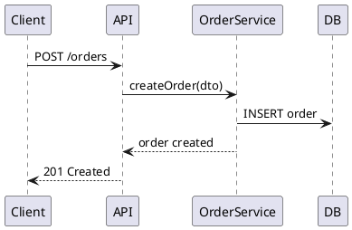
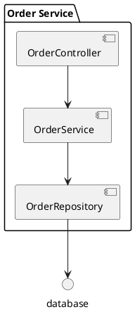

# PlantUML

> 텍스트로 UML 다이어그램을 생성하는 도구

## Overview

텍스트 코드로 UML 다이어그램을 생성하는 오픈소스 도구. 다이어그램을 코드처럼 버전 관리할 수 있어, 코드 저장소와 함께 아키텍처 문서를 관리하는 팀에 유용하다.

## Key Features

| 기능 | 설명 |
|---|---|
| **텍스트 기반** | 다이어그램을 텍스트로 작성 → Git 버전 관리 |
| **다양한 다이어그램** | 시퀀스, 컴포넌트, 클래스, 상태, 배포 다이어그램 |
| **IDE 플러그인** | IntelliJ, VS Code 플러그인 제공 |
| **Confluence 통합** | PlantUML Confluence Macro 지원 |
| **C4 지원** | C4-PlantUML 라이브러리로 C4 다이어그램 작성 |

## 시퀀스 다이어그램 예시

## 컴포넌트 다이어그램 예시

## vs Draw.io / Lucidchart

| 항목 | PlantUML | [[Draw-io]] / [[Lucidchart]] |
|---|---|---|
| **작성 방식** | 텍스트 코드 | GUI 드래그앤드롭 |
| **버전 관리** | Git에 텍스트로 저장 | 바이너리 또는 XML |
| **표현 자유도** | 제한적 (레이아웃 자동) | 유연 |
| **학습 곡선** | 문법 학습 필요 | 직관적 |

## Common Usage

- 시퀀스 다이어그램: API 설계, 서비스 간 통신 흐름 문서화
- PR에 다이어그램을 텍스트로 첨부 (코드 리뷰와 함께)
- 다이어그램을 코드 저장소와 함께 버전 관리

## Tips & Shortcuts

- `@startuml` / `@enduml` 태그로 시작/끝 표시
- `skinparam` 명령으로 스타일 커스터마이징
- `note` 키워드로 다이어그램에 주석 추가
- `!include C4Context.puml` — C4 라이브러리 임포트

## References

- [PlantUML](https://plantuml.com)
- [C4-PlantUML](https://github.com/plantuml-stdlib/C4-PlantUML)
