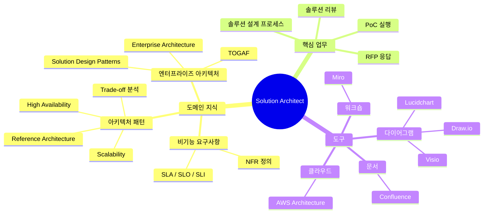

# Solution Architect Guide

> 솔루션 아키텍트의 역할·지식·실천을 한 파일로 정리한 종합 가이드

---

## 전체 지식 맵



---

## 솔루션 아키텍트란?

솔루션 아키텍트는 **고객의 비즈니스 문제를 기술 솔루션으로 변환**하는 역할이다. Software Architect가 단일 시스템의 내부 구조를 설계하는 반면, Solution Architect는 더 넓은 범위의 비즈니스 솔루션을 설계한다.

| 구분 | 솔루션 아키텍트 | 소프트웨어 아키텍트 |
|---|---|---|
| **초점** | 비즈니스 문제 → 기술 솔루션 전체 | 단일 시스템 내부 구조 |
| **고객** | 비즈니스 이해관계자, 경영진 | 개발팀, 기술 리더 |
| **산출물** | SAD, 제안서, PoC 보고서 | ADR, 아키텍처 설계 문서 |
| **스킬** | 비즈니스 이해, 제안, 프레젠테이션 | 코드 설계, 패턴, 개발 |
| **범위** | 전사·멀티 시스템 | 특정 시스템·서비스 |

---

## 핵심 도메인 지식

### 비기능 요구사항 (NFR) 체계

| 속성 | 목표 예시 | 관련 용어 |
|---|---|---|
| **가용성** | 99.9% SLO | [[High-Availability]] |
| **확장성** | 트래픽 10배 수용 | [[Scalability]] |
| **성능** | p95 응답시간 < 200ms | |
| **보안** | OWASP Top 10, 암호화 | |
| **DR** | RTO < 4h, RPO < 1h | |

### 핵심 의사결정 프레임워크: 트레이드오프

```
모든 아키텍처 결정은 트레이드오프다.
"완벽한 아키텍처"는 없다.
고객이 트레이드오프를 인지하고 결정하도록 돕는 것이 Solution Architect의 역할.
```

→ [[Trade-off]] — 트레이드오프 분석 방법

---

## 핵심 업무 흐름

### 1. 솔루션 설계 프로세스

```
킥오프 & 요구사항 수집 (FR + NFR)
→ 현황 분석 (As-Is)
→ 솔루션 범위 정의
→ 아키텍처 대안 탐색 (Reference Architecture 참조)
→ 아키텍처 설계 (To-Be) — HA, 확장성, 보안
→ 다이어그램 작성
→ 비용 추산 (TCO)
→ 리스크 평가
→ 솔루션 문서화 (SAD)
→ 솔루션 리뷰 & 발표
```

→ 상세: [[Solution-Design-Process]]

### 2. RFP 응답 프로세스

```
RFP 수신 → RFP 분석 → Bid/No-Bid 결정
→ 솔루션 설계 → 제안서 작성
→ RFP-Response-Checklist 검토 → 제출 → 발표
```

→ 체크리스트: [[RFP-Response-Checklist]]

### 3. PoC 실행 프로세스

```
PoC 필요성 식별 → 목표 & 성공 기준 정의
→ 타임박스 설정 (1~2주) → 실험 실행
→ 결과 분석 → 보고서 작성 → 아키텍처 결정
```

→ 상세: [[PoC-Execution-Process]] | 템플릿: [[PoC-Proposal-Template]]

---

## 주요 산출물

| 산출물 | 목적 | 도구 |
|---|---|---|
| **SAD** (Solution Architecture Document) | 전체 솔루션 설계 문서 | [[Confluence]] |
| **솔루션 다이어그램** | 시스템 구조 시각화 | [[Draw-io]], [[Lucidchart]], [[Visio]] |
| **Executive Summary** | 경영진용 1~2페이지 요약 | PowerPoint, Confluence |
| **비용 추산서 (TCO)** | 구현·운영 비용 분석 | Excel, AWS Pricing Calculator |
| **PoC 보고서** | 기술 검증 결과 | [[Confluence]] |
| **리스크 목록** | 리스크 및 경감 방안 | [[Confluence]], Jira |

---

## 도구 선택 가이드

| 상황 | 추천 도구 |
|---|---|
| 고객 Discovery 워크숍 | [[Miro]] |
| AWS 기반 아키텍처 다이어그램 | [[Draw-io]] (AWS 아이콘) 또는 [[Lucidchart]] |
| 고객이 Visio 파일 요구 | [[Visio]] |
| 팀 실시간 협업 다이어그램 | [[Lucidchart]] |
| 아키텍처 문서 게시 | [[Confluence]] |
| 레퍼런스 아키텍처 탐색 | [[AWS-Architecture]] (Architecture Center) |

---

## 관련 노트

### 핵심 개념
- [[Enterprise-Architecture]] — 엔터프라이즈 아키텍처 프레임워크
- [[Solution-Design-Patterns]] — 솔루션 설계 패턴
- [[Solution-Architecture-Principles]] — 설계 원칙

### 용어
- [[High-Availability]] | [[Scalability]] | [[NFR]] | [[Trade-off]]
- [[PoC]] | [[RFP]] | [[Reference-Architecture]]

### 업무 절차
- [[Solution-Design-Process]] | [[PoC-Execution-Process]]
- [[RFP-Response-Checklist]] | [[Solution-Review-Checklist]]

### 도구
- [[Draw-io]] | [[Lucidchart]] | [[Visio]] | [[Miro]] | [[Confluence]] | [[AWS-Architecture]]

### 템플릿
- [[Solution-Architecture-Document-Template]] | [[PoC-Proposal-Template]]
