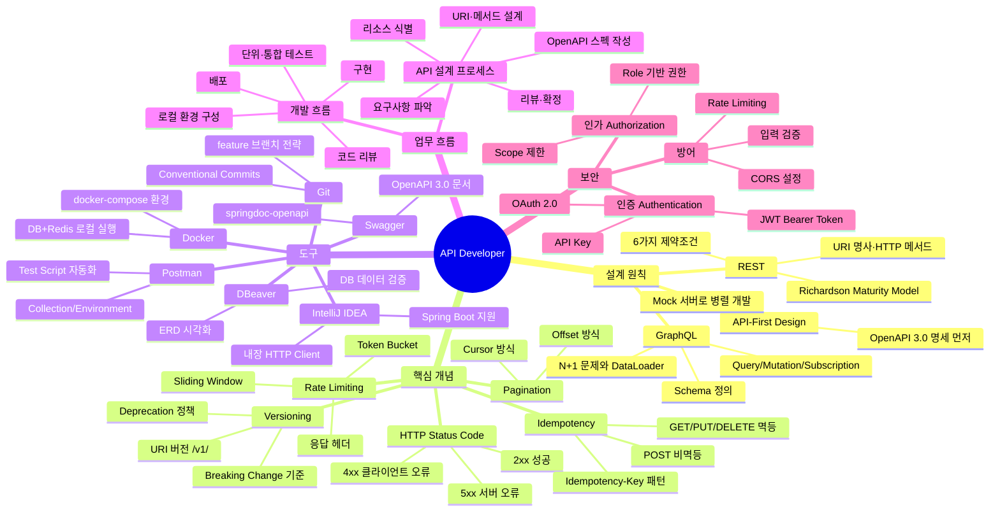
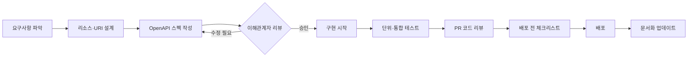

# API Developer Guide

API Developer의 핵심 지식과 실무 흐름을 한 페이지로 정리한 가이드.

## 지식 맵



## API Developer 역할

API Developer는 클라이언트와 서버 사이의 **계약(Contract)** 을 설계하고 이행하는 역할이다.

```
클라이언트 (앱/웹/파트너)
       ↕  HTTP 요청/응답
  [ API Developer 영역 ]
  - URI 설계
  - 인증·인가
  - 요청/응답 스펙
  - 에러 처리
  - 문서화
       ↕  서비스 호출
백엔드 서비스 (DB, 외부 API, 메시지 큐)
```

API는 한 번 공개하면 수정이 어렵다. **API는 코드가 아니라 사람과의 약속**이다.

## 핵심 설계 원칙 요약

### RESTful 원칙
| 원칙 | 잘못된 예 | 올바른 예 |
|---|---|---|
| 명사 사용 | `GET /getUser` | `GET /users/{id}` |
| HTTP 메서드로 행위 표현 | `POST /users/delete` | `DELETE /users/{id}` |
| 적절한 상태 코드 | 에러에 200 반환 | 에러에 400/404/422 반환 |
| 버전 명시 | `/users` (버전 없음) | `/v1/users` |
| 일관된 에러 형식 | 임의 에러 구조 | `{ "error": { "code": "...", "message": "..." } }` |

### API-First 원칙
```
Code First (구현 먼저) → 스펙이 구현에 종속, 팀 간 병목
API First  (명세 먼저) → 팀 간 병렬 개발, 명확한 계약
```

[[API-First-Design]] 참조.

## 주요 업무 흐름 요약



자세한 내용: [[API-Design-Process]], [[API-Development-Flow]]

## 도구 선택 가이드

| 상황 | 도구 |
|---|---|
| API 설계·스펙 문서 작성 | [[Swagger]] Editor, OpenAPI YAML |
| 로컬 API 빠른 테스트 | [[IntelliJ-IDEA]] HTTP Client |
| 팀 공유 API 테스트·자동화 | [[Postman]] + Newman |
| Spring Boot API 문서화 자동화 | [[Swagger]] (springdoc-openapi) |
| 로컬 개발 환경 (DB+Redis) | [[Docker]] Compose |
| DB 데이터 확인·ERD 파악 | [[DBeaver]] |
| 브랜치 관리·PR 리뷰 | [[Git]] + GitHub/GitLab |

## Related Notes

### 핵심 개념
- [[REST]] — RESTful API 아키텍처 스타일
- [[GraphQL]] — 유연한 쿼리 기반 API
- [[HTTP-Status-Code]] — API 응답 코드 완전 정리
- [[Idempotency]] — 멱등성과 Idempotency-Key
- [[Pagination]] — 대용량 데이터 페이지네이션
- [[Rate-Limiting]] — API 호출 제한 전략
- [[Versioning]] — API 버전 관리

### 도구
- [[Postman]] / [[Swagger]] / [[IntelliJ-IDEA]] / [[Docker]] / [[Git]] / [[DBeaver]]

### 업무 흐름
- [[API-Design-Process]] — 설계 프로세스
- [[API-Development-Flow]] — 개발·배포 흐름
- [[API-Review-Checklist]] — 설계 리뷰 기준
- [[API-Release-Checklist]] — 배포 전 최종 점검

### 도메인 지식
- [[API-First-Design]] — API First 설계 철학
- [[RESTful-Design]] — RESTful 설계 규칙 상세
- [[API-Security]] — 인증·보안 전략
