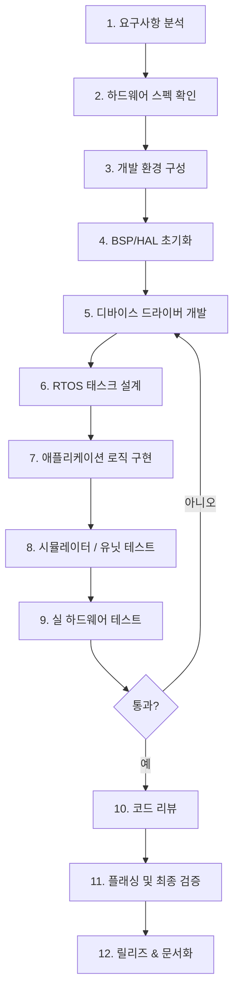

# Firmware Development Flow

> 요구사항 분석부터 펌웨어 플래싱·검증까지의 전체 개발 흐름

## Overview

임베디드 펌웨어 개발은 하드웨어 스펙과 긴밀히 연계된다. 소프트웨어만의 개발 사이클과 달리, 하드웨어 보드 입수 전후로 작업이 나뉘며 디버거(JTAG/SWD)를 통한 실 하드웨어 검증이 필수다.

## Steps

### 1. 요구사항 분석
- 기능 요구사항: 제어 대상, 통신 프로토콜, 인터페이스
- 비기능 요구사항: 응답 시간, 전력 소비, 동작 온도
- 하드웨어 제약: Flash/RAM 크기, MCU 클럭, 핀 수

### 2. 하드웨어 스펙 확인
- 회로도(Schematic) 검토: 핀 연결, 전원 레일, 외부 부품
- 데이터시트: MCU, 센서, 통신 모듈 스펙 확인
- 클럭 소스: HSE/HSI/PLL 구성 계획

### 3. 개발 환경 구성
- [[STM32CubeIDE]] 또는 [[Keil-MDK]] 설치
- [[GCC]] 툴체인, [[OpenOCD]] 설정
- [[Git]] 저장소 초기화, 브랜치 전략 수립

### 4. BSP/HAL 초기화
- CubeMX로 핀맵, 클럭 트리, 주변장치 설정 생성
- 시스템 클럭(SystemClock_Config) 검증
- 디버그 포트([[UART]]) 초기화 — 첫 printf 출력 확인

### 5. 디바이스 드라이버 개발
- [[GPIO]], [[UART]], [[SPI]], [[I2C]] 등 주변장치 드라이버
- 각 드라이버 독립 테스트 후 다음 단계 진행
- HAL 위에 추상화 레이어 작성 (포팅 용이성)

### 6. RTOS 태스크 설계
- [[RTOS]] 사용 여부 결정 (bare-metal vs FreeRTOS)
- 태스크 분리, 우선순위 설계
- 태스크 간 통신 방식 결정 (큐/세마포어)

### 7. 애플리케이션 로직 구현
- 상태 머신(State Machine) 설계
- 에러 처리 및 Watchdog 설정
- 전력 관리 (Sleep/Stop 모드)

### 8. 시뮬레이터 / 유닛 테스트
- Unity/CppUTest 등으로 하드웨어 독립 유닛 테스트
- QEMU로 로직 검증 (지원 MCU 한정)

### 9. 실 하드웨어 테스트
- [[GDB]]+[[OpenOCD]]로 온-칩 디버깅
- 로직 애널라이저로 통신 파형 검증
- 경계값, 장기 연속 동작 테스트

### 10. 코드 리뷰
- MISRA-C 준수 여부 확인 (안전 필수 시스템)
- 메모리 누수, 스택 오버플로우 점검

### 11. 플래싱 및 최종 검증
- [[Firmware-Release-Checklist]] 수행
- 릴리즈 빌드 플래그(-Os, 디버그 심볼 제거) 확인
- Flash/RAM 사용량 확인

### 12. 릴리즈 & 문서화
- [[Git]] 태그 부착 (`git tag -a v1.0.0`)
- 변경 이력(Changelog) 작성
- [[Projects/Templates/Firmware-Version-Template|Firmware-Version-Template]] 작성

## Inputs

- 하드웨어 회로도(Schematic), 부품 데이터시트
- 제품 요구사항 문서(PRD/SRS)
- 이전 버전 펌웨어 (있는 경우)

## Outputs

- `.bin` / `.hex` / `.elf` 펌웨어 바이너리
- 릴리즈 노트 및 버전 문서
- 테스트 결과 보고서

## Notes

- 드라이버 개발 시 하나씩 검증하며 진행 (통합 후 디버깅은 어려움)
- 실 하드웨어 없이 로직 검증은 HOST 컴파일 + 유닛 테스트로 진행
- RTOS 도입 시 태스크 스택 크기를 넉넉히 설정하고 나중에 최적화

## Related

- [[Hardware-Bring-Up-Process]] — 첫 하드웨어 검증 절차
- [[Firmware-Release-Checklist]] — 릴리즈 전 체크리스트
