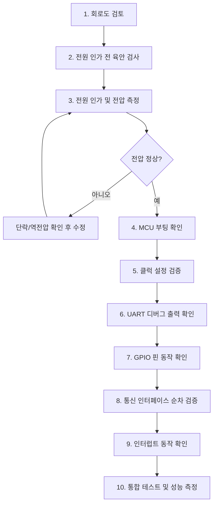

# Hardware Bring-Up Process

> 새 하드웨어 보드를 처음 동작시키는 단계별 절차

## Overview

하드웨어 브링업은 새로 제작된 PCB를 처음으로 동작시키는 과정이다. 회로 설계 오류, 납땜 불량, 부품 방향 오류 등 다양한 문제가 발생할 수 있으므로 **한 번에 하나씩 검증**하는 점진적 접근이 핵심이다. 처음부터 전체 시스템을 올리려 하면 문제 원인을 찾기 어렵다.

## Steps

### 1. 회로도 검토
- 전원 레일(VCC, GND, 3.3V, 5V) 연결 확인
- 디커플링 캐패시터 배치 확인
- MCU 부트 핀(BOOT0) 초기 상태 확인
- 풀업/풀다운 저항 값 적절성 확인

### 2. 전원 인가 전 육안 검사
- 부품 방향(극성) 확인: 전해 캐패시터, 다이오드, IC
- 납땜 브릿지(납땜 쇼트) 확인
- 미납땜 핀 확인
- 멀티미터로 VCC-GND 간 단락 저항 측정 (0Ω이면 단락)

### 3. 전원 인가 및 전압 측정
- 전류 제한 설정 전원 공급기 사용 권장 (과전류 보호)
- 각 전원 레일 전압 측정: 3.3V, 1.8V, 5V 등
- MCU VDD 핀 전압 확인

### 4. MCU 부팅 확인 (디버거 연결)
- ST-Link/J-Link 연결, [[OpenOCD]] 실행
- `monitor reset halt` 명령으로 MCU 접근 확인
- MCU Device ID 읽기로 올바른 MCU 확인

### 5. 클럭 설정 검증
- SystemClock_Config 실행 후 SysTick 동작 확인
- `HAL_GetTick()` 카운트가 1ms 단위로 증가하는지 확인
- 오실로스코프로 MCO 핀 출력 측정 (외부 클럭 소스 확인)

### 6. UART 디버그 출력 확인
- [[UART]] 디버그 포트(보통 UART2) 초기화
- `printf("Boot OK\r\n")` 출력 확인 (PC에서 시리얼 터미널)
- 이후 모든 단계에서 로그 출력 활용

### 7. GPIO 핀 동작 확인
- LED Blink 테스트: 500ms 토글로 기본 동작 확인
- 버튼 입력 읽기: Pull-up 설정 후 눌림 감지 확인
- [[GPIO]] 핀 설정이 회로도와 일치하는지 교차 확인

### 8. 통신 인터페이스 순차 검증
- **[[I2C]]**: 주소 스캔(I2C Scanner)으로 장치 응답 확인
- **[[SPI]]**: 루프백 테스트 후 실제 장치와 통신
- **[[UART]]**: 에코 테스트 (TX→RX 연결)
- **CAN/USB**: 각 프로토콜 분석기로 검증

### 9. 인터럽트 동작 확인
- 외부 [[Interrupt|GPIO 인터럽트]] 트리거 확인
- 타이머 인터럽트 주기 정확성 측정 (오실로스코프)
- ISR 진입/종료 로그로 동작 검증

### 10. 통합 테스트 및 성능 측정
- 전체 시스템 통합 동작 확인
- 온도 범위 테스트 (-40℃ ~ +85℃)
- 장기 연속 동작 테스트 (24~72시간)
- 전류 소비 측정

## Inputs

- PCB 회로도(Schematic), 부품 배치도(Layout)
- MCU 데이터시트, 각 부품 데이터시트
- 디버거(ST-Link, J-Link), 멀티미터, 오실로스코프

## Outputs

- 브링업 테스트 결과 보고서
- 발견된 하드웨어 오류 목록 및 수정 내용
- 검증된 초기 펌웨어 기준 코드

## Notes

- 항상 전류 제한 전원 공급기로 시작 (쇼트 발생 시 부품 보호)
- 문제 발생 시 한 단계씩 되돌아가 원인 격리
- 브링업 완료 후 [[Hardware-Bring-Up-Checklist]] 서명 보관

## Related

- [[Firmware-Development-Flow]] — 브링업 이후 본격 펌웨어 개발
- [[Hardware-Bring-Up-Checklist]] — 항목별 체크리스트
