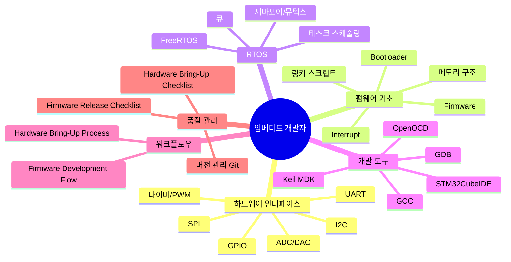

# Embedded Systems Developer Guide

> 임베디드 시스템 개발자 종합 가이드 — 지식 맵, 핵심 개념, 도구 선택

## 역할 설명

임베디드 시스템 개발자는 마이크로컨트롤러(MCU)·FPGA 등 하드웨어를 직접 제어하는 [[Firmware|펌웨어]]와 소프트웨어를 개발한다. 운영체제 없이 bare-metal로 동작하거나 [[RTOS]]를 활용하며, 메모리·전력·실시간성 제약 안에서 동작하는 시스템을 만든다. 소프트웨어 지식뿐 아니라 회로 이해와 측정 장비(오실로스코프, 로직 애널라이저) 활용 능력도 필요하다.

## 지식 맵



## 핵심 도메인 지식 요약

### 하드웨어 인터페이스

| 프로토콜 | 선 수 | 속도 | 주요 용도 |
|----------|-------|------|----------|
| [[GPIO]] | 1 | — | LED, 버튼, 단순 디지털 I/O |
| [[UART]] | 2 (TX/RX) | ~10 Mbps | 디버그, 모듈 통신 |
| [[SPI]] | 4+ | 수십 MHz | Flash, 디스플레이, 고속 ADC |
| [[I2C]] | 2 (SDA/SCL) | ~1 MHz | 센서, EEPROM, RTC |

### 메모리 구조

```
Flash (프로그램 메모리)          RAM (데이터 메모리)
┌──────────────────┐            ┌──────────────────┐
│ .text (코드)      │            │ .data (초기값 변수)│  ← Flash에서 복사
│ .rodata (상수)    │            │ .bss (0 초기화)   │
│ .data 초기값      │            │ Stack             │
│ Bootloader       │            │ Heap              │
└──────────────────┘            └──────────────────┘
```

### 인터럽트 처리 원칙

- ISR은 짧고 빠르게: 플래그 세우고 메인/태스크에서 처리
- [[RTOS]] 사용 시 `FromISR` suffix API 사용
- 우선순위 설계: 시간 민감 → 높은 우선순위

## 주요 업무 흐름 요약

### 신규 프로젝트

1. 요구사항 분석 → MCU 선정 → [[Firmware-Development-Flow]] 시작
2. [[Hardware-Bring-Up-Process]] 완료 후 드라이버 개발
3. [[RTOS]] 도입 여부 결정 → 태스크 설계
4. [[Firmware-Release-Checklist]] 완료 후 릴리즈

### 버그 디버깅

1. [[UART]] 로그로 현상 재현 확인
2. [[GDB]] + [[OpenOCD]] 온-칩 디버깅
3. 로직 애널라이저로 통신 파형 검증
4. HardFault 시: GDB `backtrace` + 스택 프레임 분석

## 도구 선택 가이드

| 상황 | 권장 도구 |
|------|----------|
| STM32 신규 프로젝트 (무료) | [[STM32CubeIDE]] |
| ARM 상용 프로젝트, 최적 코드 크기 | [[Keil-MDK]] |
| 커맨드라인 빌드, CI/CD | [[GCC]] + Makefile/CMake |
| MCU 플래싱·디버깅 (오픈소스) | [[OpenOCD]] + [[GDB]] |
| 바이너리 배포·롤백 관리 | [[Git]] 태그 전략 |

## Related Notes

### 용어
- [[Bootloader]] — 전원 인가 시 첫 실행 코드
- [[Firmware]] — 하드웨어에 내장된 소프트웨어
- [[GPIO]] — 범용 입출력 핀
- [[UART]] — 비동기 직렬 통신
- [[SPI]] — 동기식 고속 직렬 통신
- [[I2C]] — 2선 멀티 디바이스 통신
- [[Interrupt]] — 하드웨어 이벤트 반응 메커니즘
- [[RTOS]] — 실시간 운영체제

### 도구
- [[GCC]] — ARM 크로스 컴파일러
- [[GDB]] — GNU 디버거
- [[OpenOCD]] — 온-칩 디버거 인터페이스
- [[STM32CubeIDE]] — STM32 전용 IDE
- [[Keil-MDK]] — ARM 상용 IDE
- [[Git]] — 버전 관리

### 워크플로우 및 체크리스트
- [[Firmware-Development-Flow]] — 전체 개발 흐름
- [[Hardware-Bring-Up-Process]] — 하드웨어 최초 검증
- [[Firmware-Release-Checklist]] — 릴리즈 전 체크리스트
- [[Hardware-Bring-Up-Checklist]] — 브링업 체크리스트

### 도메인 지식
- [[MCU-Architecture]] — MCU 아키텍처 개념
- [[Real-Time-Systems]] — 실시간 시스템 개념
- [[Embedded-Design-Principles]] — 임베디드 설계 원칙
