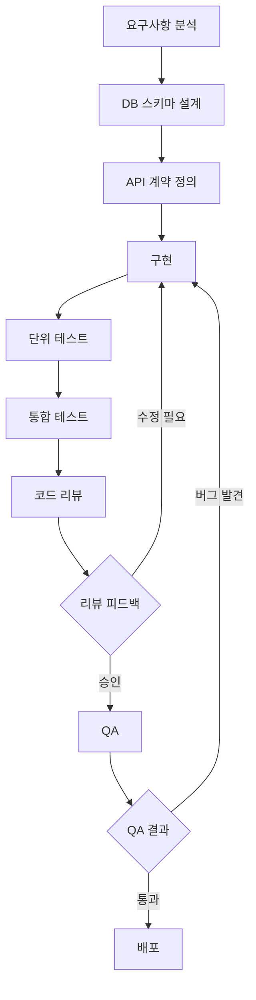

# Feature Development Flow

> 요구사항 분석부터 PR 머지까지 서버 기능 개발 전체 흐름

## Overview

서버 개발자가 새 기능을 구현할 때 따르는 표준 흐름이다. 각 단계를 순서대로 따르면 요구사항 오해, DB 설계 실수, 누락된 예외 처리로 인한 재작업을 줄일 수 있다.



## Steps

### 1. 요구사항 분석
- 기획서/티켓을 꼼꼼히 읽고, 모호한 부분은 기획자·PO에게 질문으로 해결한다
- 엣지 케이스를 미리 정의한다 (예: 재고 0일 때 주문, 이미 취소된 주문 재취소)
- 인증·인가 요구사항 확인 (누가 이 API를 호출할 수 있는가?)
- **결과물**: 해결된 질문 목록, 명확한 요구사항 문서

### 2. DB 스키마 설계
- 필요한 테이블, 컬럼, 제약조건(NOT NULL, UNIQUE, FK)을 설계한다
- 인덱스 전략: 조회 조건이 될 컬럼에 인덱스 계획
- 기존 테이블 수정 시 하위 호환성 고려 (컬럼 삭제는 위험)
- 마이그레이션 스크립트 작성 (Flyway/Liquibase)
- **결과물**: ERD 또는 스키마 변경 명세, 마이그레이션 파일

### 3. API 계약 정의
- HTTP 메서드, URL 경로, 요청/응답 형식을 프론트엔드 팀과 먼저 합의한다
- OpenAPI(Swagger) 스펙 또는 간단한 문서로 계약 명문화
- 에러 응답 코드 및 메시지 형식 정의
- **결과물**: API 스펙 문서 (계약). 프론트엔드는 Mock 서버로 병렬 개발 가능

### 4. 구현 (Service / Repository / Controller 순서)
```
Service (비즈니스 로직) → Repository (데이터 접근) → Controller (HTTP 어댑터)
```
- **Service**: 핵심 비즈니스 규칙. 트랜잭션 경계 설정
- **Repository**: DB 쿼리. N+1 문제 주의, 필요한 인덱스 확인
- **Controller**: 요청 파싱, 입력 검증(`@Valid`), 응답 포매팅

```java
// 구현 순서 예시 (주문 생성)
// 1. OrderRepository: findById, save 등
// 2. OrderService: createOrder(userId, request) - 재고 확인, 결제 처리, 주문 저장
// 3. OrderController: POST /api/orders - 요청 파싱, 서비스 호출, 응답 반환
```

### 5. 단위 테스트
- Service 레이어 단위 테스트: Repository를 Mock으로 대체
- 핵심 비즈니스 로직의 Happy Path + 예외 케이스 모두 커버
- 외부 의존성(DB, 외부 API) 없이 빠르게 실행되어야 함

```java
@ExtendWith(MockitoExtension.class)
class OrderServiceTest {
    @Mock OrderRepository orderRepository;
    @InjectMocks OrderService orderService;

    @Test
    void 재고_부족_시_주문_실패() {
        // given
        when(productRepository.findById(1L)).thenReturn(Optional.of(outOfStockProduct));
        // when & then
        assertThrows(InsufficientStockException.class,
            () -> orderService.createOrder(userId, request));
    }
}
```

### 6. 통합 테스트
- 실제 DB(H2 또는 테스트 컨테이너)를 사용한 전체 흐름 테스트
- API 레벨에서 HTTP 요청 → 응답 검증 (`@SpringBootTest` + `MockMvc`)
- 테스트 격리: 각 테스트 후 `@Transactional`로 롤백 또는 데이터 정리

### 7. 코드 리뷰
- PR 크기를 작게 유지 (300줄 이하 권장)
- [[Code-Review-Checklist]] 항목으로 셀프 리뷰 먼저 수행
- PR 설명에 변경 배경, 주요 결정 사항, 테스트 방법 포함

### 8. QA
- QA 엔지니어 또는 팀원이 스테이징 환경에서 기능 검증
- 시나리오 테스트, 엣지 케이스, 기존 기능 영향도 확인
- 발견된 버그는 4번 구현 단계로 돌아가 수정

### 9. 배포
- [[Deployment-Checklist]] 항목 확인
- DB 마이그레이션 적용 (서비스 배포 전)
- 배포 후 헬스체크, 에러 로그, 주요 지표 모니터링

## Inputs

- 기획서/요구사항 티켓
- 기존 DB 스키마 및 ERD
- API 가이드라인 (팀 컨벤션)
- 연관 서비스 API 문서

## Outputs

- 마이그레이션 파일 (DB 스키마 변경)
- 구현된 API (Service/Repository/Controller)
- 단위 테스트 + 통합 테스트 코드
- API 스펙 문서 업데이트
- 배포된 기능

## Notes

- DB 스키마와 API 계약은 팀 합의 후 진행. 혼자 결정하지 않는다
- 구현 → 테스트 순서를 지키거나, TDD(테스트 먼저 작성 후 구현)를 적용
- "일단 동작하게" 만들고 나서 리팩토링. 처음부터 완벽한 설계를 추구하지 않는다
- 코드 리뷰를 받기 전에 본인이 먼저 PR을 읽어보는 습관을 들인다
