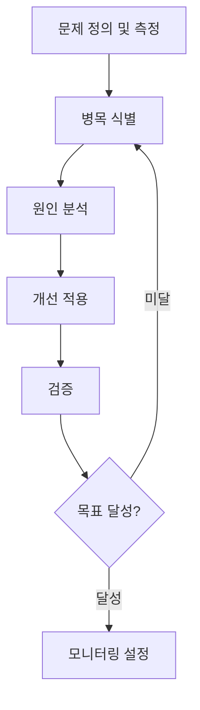
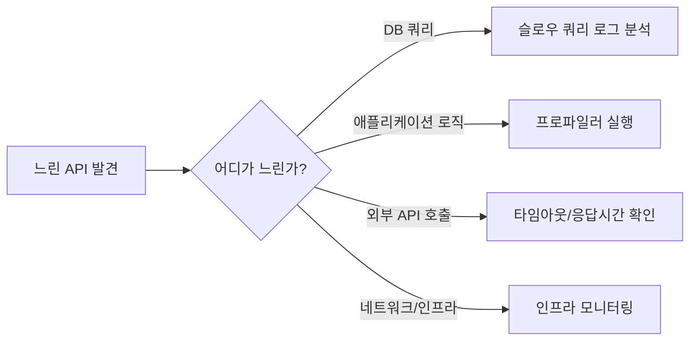

# Performance Tuning Process

> 병목 탐지·프로파일링·최적화·검증 절차

## Overview

성능 문제는 추측이 아닌 측정에 기반해야 한다. "느린 것 같다"는 느낌이 아니라 구체적인 수치로 문제를 정의하고, 병목을 데이터로 식별한 후 개선을 적용하고 검증한다.



## Steps

### 1. 문제 정의 및 측정
성능 목표를 수치로 명확히 정의한다. 막연히 "빠르게"가 아니라 구체적인 기준을 세운다.

**측정 지표**:
- **응답 시간**: P50, P95, P99 (평균이 아닌 백분위수로 측정)
- **처리량 (TPS/RPS)**: 초당 처리 요청 수
- **에러율**: 5xx 비율
- **리소스 사용률**: CPU, 메모리, DB 커넥션

```bash
# 현재 상태 측정 예시
# APM 도구 없을 때 간이 부하 테스트
wrk -t4 -c100 -d30s http://localhost:8080/api/products
# → Requests/sec, Latency P50/P99 확인
```

**결과물**: "P95 응답시간 3,200ms → 목표: 500ms 이하"처럼 Before/After 기준 설정

### 2. 병목 식별 (프로파일링 / 슬로우 쿼리)



**DB 슬로우 쿼리 확인**:
```sql
-- MySQL 슬로우 쿼리 활성화
SET GLOBAL slow_query_log = 'ON';
SET GLOBAL long_query_time = 1;  -- 1초 이상 걸리는 쿼리 기록

-- 실행 계획 확인
EXPLAIN SELECT * FROM orders WHERE user_id = 100;
-- type: ALL (풀 테이블 스캔) → 인덱스 추가 필요
-- type: ref 또는 const → 인덱스 사용 중
```

**JVM 프로파일링**:
```bash
# JFR (Java Flight Recorder) - JVM 내장 프로파일러
java -XX:+FlightRecorder \
     -XX:StartFlightRecording=duration=60s,filename=profile.jfr \
     -jar myapp.jar
# 결과를 JDK Mission Control (JMC) 또는 IntelliJ Profiler로 분석
```

**로그 기반 빠른 확인**:
```java
// 메서드 실행 시간 측정 (개발 중 임시 확인)
long start = System.currentTimeMillis();
// ... 작업 ...
log.info("메서드 실행 시간: {}ms", System.currentTimeMillis() - start);

// Spring AOP로 모든 서비스 레이어 측정
@Around("execution(* com.example.service.*.*(..))")
public Object logExecutionTime(ProceedingJoinPoint pjp) throws Throwable {
    long start = System.currentTimeMillis();
    Object result = pjp.proceed();
    log.info("{} 실행 시간: {}ms", pjp.getSignature(), System.currentTimeMillis() - start);
    return result;
}
```

### 3. 원인 분석

병목 유형별 일반적인 원인:

| 병목 위치 | 일반적인 원인 |
|----------|-------------|
| DB 쿼리 | 인덱스 누락, N+1 문제, 불필요한 컬럼 조회(SELECT *), 락 경합 |
| 애플리케이션 | 불필요한 반복 연산, 동기 처리로 인한 스레드 낭비, 메모리 릭 |
| 네트워크 | 불필요한 외부 API 직렬 호출, 큰 응답 크기 |
| 인프라 | CPU/메모리 부족, 커넥션 풀 고갈 |

### 4. 개선 적용

**인덱스 추가**:
```sql
-- 조회 조건 컬럼에 인덱스 추가
CREATE INDEX idx_orders_user_id_status ON orders(user_id, status);
-- 복합 인덱스: user_id로 먼저 필터, status로 추가 필터
-- 주의: 인덱스는 INSERT/UPDATE/DELETE 성능을 낮춤
```

**N+1 문제 해결**:
```java
// Before: N+1
List<Order> orders = orderRepository.findAll();
// After: Fetch Join으로 한 번에 조회
@Query("SELECT o FROM Order o JOIN FETCH o.items WHERE o.status = :status")
List<Order> findWithItems(@Param("status") OrderStatus status);
```

**캐싱 적용**:
```java
@Cacheable(value = "productCache", key = "#id")
public Product getProduct(Long id) {
    return productRepository.findById(id).orElseThrow();
}
```

**비동기 처리로 응답 시간 개선**:
```java
// 직렬 호출 → 병렬 호출
CompletableFuture<UserInfo> userFuture = userService.getUserAsync(userId);
CompletableFuture<List<Order>> ordersFuture = orderService.getOrdersAsync(userId);
CompletableFuture.allOf(userFuture, ordersFuture).join();
```

### 5. 검증
개선 적용 후 반드시 동일 조건에서 재측정한다.

- 1번에서 정한 기준으로 Before/After 비교
- 개선이 다른 API나 기능에 부정적 영향을 주지 않는지 확인
- 부하 테스트로 고부하 상황에서도 유지되는지 검증

### 6. 모니터링 설정
재발 방지를 위한 지속적 모니터링 설정.

- 응답 시간 P95 임계값 초과 시 알림
- DB 슬로우 쿼리 발생 시 알림
- 에러율 급증 시 알림 (Prometheus + Grafana, Datadog, New Relic 등)

## Inputs

- APM 도구 데이터 (Datadog, New Relic, Pinpoint 등)
- DB 슬로우 쿼리 로그
- 애플리케이션 로그
- 인프라 모니터링 대시보드
- 사용자 불편 신고 또는 SLA 위반 알림

## Outputs

- 병목 원인 분석 보고서
- 적용된 최적화 (인덱스, 캐싱, 쿼리 개선 등)
- Before/After 성능 측정 결과
- 모니터링 알림 규칙 설정

## Notes

- **측정 없이 최적화 금지**: 추측으로 최적화하면 엉뚱한 곳에 시간을 낭비한다
- **조기 최적화는 악의 근원**: 기능이 올바르게 동작하는 것이 우선. 실제 성능 문제가 생겼을 때 최적화한다
- **트레이드오프 인식**: 캐싱은 메모리 사용 증가, 인덱스는 쓰기 성능 저하를 동반한다
- **작은 변경 단위**: 여러 최적화를 동시에 적용하면 어떤 것이 효과적인지 알 수 없다
