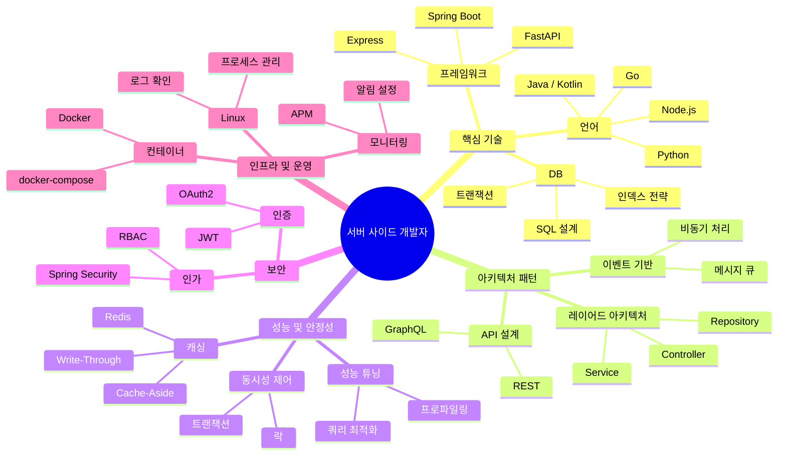

# Server-Side Developer Guide

> 서버 사이드 개발자를 위한 종합 가이드

## 역할 설명

서버 사이드 개발자는 클라이언트(웹/앱)가 요청하면 비즈니스 규칙을 수행하고, 데이터를 처리해 응답을 돌려주는 **서버 측 코드를 전담하는 엔지니어**다.

단순히 동작하는 코드를 넘어, **수천~수만 건의 동시 요청을 안정적으로 처리**하고 장애 상황에서도 서비스가 지속될 수 있도록 설계하는 것이 핵심이다.

## 지식 마인드맵



## 핵심 도메인 지식 요약

| 분야 | 핵심 개념 | 주요 이슈 | 참고 문서 |
|------|----------|----------|----------|
| **캐싱** | Cache Hit/Miss, TTL, 무효화 | Stale Data, Cache Stampede | [[Caching]] |
| **동시성** | Thread, Race Condition, Lock | Deadlock, 성능 저하 | [[Concurrency]] |
| **커넥션 풀** | 풀 재사용, maximumPoolSize | 풀 고갈, 타임아웃 | [[Connection-Pool]] |
| **JWT** | Header.Payload.Signature | 탈취, none 알고리즘 공격 | [[JWT]] |
| **메시지 큐** | Producer/Broker/Consumer | 전달 보장, 멱등성 | [[Message-Queue]] |
| **미들웨어** | 요청-응답 파이프라인 | 순서 중요, 성능 영향 | [[Middleware]] |
| **ORM** | 엔티티-테이블 매핑 | N+1 문제, 지연 로딩 | [[ORM]] |

## 주요 업무 흐름 요약

### 기능 개발 흐름
```
요구사항 분석 → DB 스키마 설계 → API 계약 정의 → 구현(Service/Repository/Controller)
→ 단위 테스트 → 통합 테스트 → 코드 리뷰 → QA → 배포
```
자세히 보기: [[Feature-Development-Flow]]

### 성능 튜닝 흐름
```
문제 정의 및 측정 → 병목 식별(프로파일링/슬로우 쿼리) → 원인 분석
→ 개선 적용(인덱스/캐싱/쿼리 최적화) → 검증 → 모니터링
```
자세히 보기: [[Performance-Tuning-Process]]

## 도구 선택 가이드

| 상황 | 권장 도구 | 비고 |
|------|----------|------|
| Java/Spring 개발 IDE | [[IntelliJ-IDEA]] | 디버거, Spring 통합 최강 |
| 로컬 인프라 실행 (DB, Redis) | [[Docker]] | docker-compose로 팀 공유 |
| API 개발 중 빠른 테스트 | [[Postman]] 또는 IntelliJ HTTP Client | Postman은 팀 공유 유리 |
| 빌드 및 의존성 관리 | [[Maven]] 또는 Gradle | 신규 프로젝트는 Gradle 선호 |
| 버전 관리 | [[Git]] | Conventional Commits 권장 |
| 서버 로그/프로세스 확인 | [[Linux]] | SSH 접속 후 tail/grep/ps |
| Node.js/Python/Go 개발 | [[VS-Code]] | 경량, 확장성 우수 |

## 성능 트레이드오프 빠른 참조

| 최적화 방법 | 얻는 것 | 잃는 것 |
|------------|---------|---------|
| 캐싱 추가 | 응답 속도 향상, DB 부하 감소 | 메모리 사용량 증가, 데이터 정합성 복잡 |
| 인덱스 추가 | 조회 속도 향상 | INSERT/UPDATE/DELETE 성능 저하 |
| 비동기 처리 | 응답 시간 단축 | 코드 복잡도 증가, 디버깅 어려움 |
| 커넥션 풀 확대 | 동시 처리량 증가 | DB 서버 부하 증가 |
| Eager Loading | 쿼리 수 감소 | 불필요한 데이터 로드 |

## Related Notes

### 용어 (Terminology)
- [[Caching]] - 캐싱 전략과 Redis 활용
- [[Concurrency]] - 동시성 제어와 락 메커니즘
- [[Connection-Pool]] - DB 커넥션 풀 설정과 튜닝
- [[JWT]] - 인증 토큰 구조와 보안 주의사항
- [[Message-Queue]] - 비동기 메시지 처리
- [[Middleware]] - 요청-응답 파이프라인
- [[ORM]] - JPA/Hibernate와 N+1 문제

### 도구 (Tools)
- [[Docker]] - 컨테이너화와 로컬 개발환경
- [[Git]] - 버전 관리와 브랜치 전략
- [[IntelliJ-IDEA]] - Java/Spring 개발 IDE
- [[Linux]] - 서버 운영 필수 명령어
- [[Maven]] - 빌드 도구
- [[Postman]] - API 테스트 자동화
- [[VS-Code]] - 경량 에디터

### 업무 프로세스 (Core Tasks)
- [[Feature-Development-Flow]] - 기능 개발 전체 흐름
- [[Performance-Tuning-Process]] - 성능 튜닝 프로세스
- [[Code-Review-Checklist]] - 코드 리뷰 체크리스트
- [[Deployment-Checklist]] - 배포 전 체크리스트

### 프로젝트 템플릿
- [[Feature-Spec-Template]] - 기능 개발 스펙 문서 템플릿
